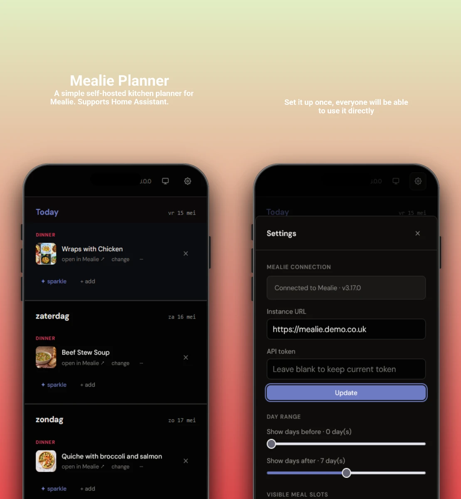

# Mealie Planner

[](LICENSE)
[](#)
[](https://github.com/hawkinslabdev/mealie-planner/blob/main/mealie-planner/CHANGELOG.md)
[](https://my.home-assistant.io/redirect/supervisor_add_addon_repository/?repository_url=https%3A%2F%2Fgithub.com%2Fhawkinslabdev%2Fmealie-planner%2F)
[](https://coff.ee/hawkinslabdev)

Mealie Planner is a self-hosted week-view meal planner for [Mealie](https://mealie.io). Browse your recipe library, drag meals onto your week grid, and let the sparkle feature suggest random dishes. Enable the quick-add feature to import recipes from video, web page or image.



We want to make it incredibly simple to plan your meals for the week ahead. Manage your weekly meal plans with Mealie Planner. Share access and use the week-at-a-glance view. All in your native language.

## Installation

### Home Assistant

[](https://my.home-assistant.io/redirect/supervisor_add_addon_repository/?repository_url=https%3A%2F%2Fgithub.com%2Fhawkinslabdev%2Fmealie-planner%2F)

1. In Home Assistant, go to **Settings → Apps** and select **Install app**
2. Click **⋮ → Repositories**
3. Paste `https://github.com/hawkinslabdev/mealie-planner` and click **Add**
4. Search for **Mealie Planner**, select it, and click **Install**

When that's done then start the app, and enter your Mealie instance and [API key](https://docs.mealie.io/documentation/getting-started/api-usage/#getting-a-token).

### Docker Compose

```yaml
services:
  mealie-planner:
    image: ghcr.io/hawkinslabdev/mealie-planner:latest
    ports:
      - "3000:3000"
    volumes:
      - ./data:/app/data
    environment:
      - MEALIE_API_URL=https://mealie.yourdomain.com
      - MEALIE_API_KEY=your-api-key-here
      # Optional and absolutely not necessary:
      - PIN_CODE=ABC123
    restart: unless-stopped
```

After starting the container, the application will be available at `http://localhost:3000`. 

## License

This project is licensed under the **AGPL 3.0** license. See [LICENSE](LICENSE) for details. This project is not affiliated with [Mealie](https://mealie.io).

## Contributing

Contributions including ideas, bug reports, and pull requests are welcome. Please open an issue to discuss any proposed changes or identified issues.
